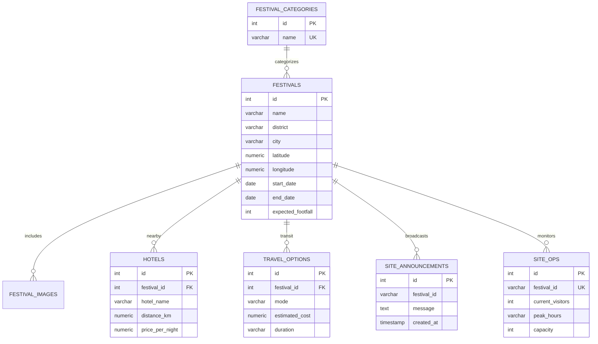

# SanskritiPulse AI (YuktiAi) - Multi-Stakeholder Unified Backend


Welcome to the unified backend repository for **SanskritiPulse AI (YuktiAi)** — a comprehensive cultural discovery platform, travel planner, AI recommendation engine, government intelligence system, and live site operations hub for Karnataka's festivals and heritage events.

---

## 👥 Multi-Stakeholder Architecture & Team Roles

| Role | Team Member | Module / Engine | Key Endpoint Routes |
| :--- | :--- | :--- | :--- |
| **Member 1** | Tezraj | Core PostgreSQL DB & Dataset | `GET /festivals`, `GET /festivals/{id}` |
| **Member 2** | Nandish | AI Recommendation & Multilingual Engine | `POST /recommend`, `POST /translate` |
| **Member 3** | Simran | Travel Planner & Hotel Engine | `POST /travel-plan`, `GET /hotels/{location}` |
| **Member 4** | Monika | Tourist Dashboard & Live Updates | `GET /announcements/{festival_id}` |
| **Member 5** | Gov Analytics | Department Intelligence & Crowd Risk | `GET /analytics/overview`, `GET /analytics/map-data`, `GET /analytics/trends` |
| **Member 6** | Tanishi | Organizer Site Ops & Live Announcements | `GET /organizer/overview/{id}`, `POST /organizer/announcement` |

---

## 🏗️ Relational Database Schema



---

## 🚀 Quickstart & Setup Guide

### 1. Installation
```bash
pip install -r requirements.txt
```

### 2. Start PostgreSQL & Run Migration Pipeline
```bash
docker compose up -d
python seed.py
```

### 3. Run FastAPI Application Server
```bash
uvicorn main:app --reload --port 8000
```
- **Interactive Swagger UI Documentation:** [http://localhost:8000/docs](http://localhost:8000/docs)
- **ReDoc Documentation:** [http://localhost:8000/redoc](http://localhost:8000/redoc)

---

## 📡 Complete REST API Documentation

### 1. Core Festivals (Member 1 - Tezraj)

#### `GET /festivals`
- **Description:** Retrieve master festivals list with optional query parameters.
- **Query Params:** `district`, `category`, `date` (`YYYY-MM-DD`).
- **Example:** `curl "http://localhost:8000/festivals?district=Mysuru"`

#### `GET /festivals/{festival_id}`
- **Description:** Detailed view including images, hotel options, and transit routes.
- **Example:** `curl "http://localhost:8000/festivals/1"`

---

### 2. AI Recommendation & Multilingual Engine (Member 2 - Nandish)

#### `POST /recommend`
- **Description:** Matches user interest tags against festival vector embeddings using Cosine Similarity.
- **Request Body:**
  ```json
  {
    "interests": ["food", "folk", "culture", "heritage"]
  }
  ```
- **Response Example:**
  ```json
  {
    "status": "success",
    "recommendations": [
      {
        "festival_id": "mysuru-dasara",
        "name": "Mysuru Dasara",
        "district": "Mysuru",
        "category": "State Festival & Royal Heritage",
        "score": 88.5
      }
    ]
  }
  ```

#### `POST /translate`
- **Description:** Translates input text into Kannada (`kn`), Hindi (`hi`), or English (`en`).
- **Request Body:**
  ```json
  {
    "text": "Welcome to Mysuru Dasara festival",
    "target_lang": "kn"
  }
  ```
- **Response Example:**
  ```json
  {
    "original_text": "Welcome to Mysuru Dasara festival",
    "target_lang": "kn",
    "translated_text": "ಮೈಸೂರು ದಸರಾ ಹಬ್ಬಕ್ಕೆ ಸುಸ್ವಾಗತ"
  }
  ```

---

### 3. Travel Planner & Hotel Engine (Member 3 - Simran)

#### `POST /travel-plan`
- **Description:** Calculates travel matrix options (Bus, Train, Car) from Karnataka hubs to festival destinations and builds structured 2-day itineraries.
- **Request Body:**
  ```json
  {
    "origin": "Bangalore",
    "festival_id": "mysuru-dasara",
    "date": "2026-10-15"
  }
  ```
- **Response Example:**
  ```json
  {
    "origin": "Bangalore",
    "destination": "Mysuru",
    "festival_name": "Mysuru Dasara",
    "distance_km": 145.0,
    "mode_comparisons": [
      { "mode": "Bus", "duration": "2.9 hours", "estimated_cost": "₹319" },
      { "mode": "Train", "duration": "2.4 hours", "estimated_cost": "₹217" },
      { "mode": "Car (Private / Taxi)", "duration": "1.9 hours", "estimated_cost": "₹1160" }
    ],
    "itinerary": {
      "day1": { "title": "Arrival in Mysuru & Evening Festival Experience", "schedule": [...] },
      "day2": { "title": "Local Heritage Tour & Grand Procession", "schedule": [...] }
    }
  }
  ```

#### `GET /hotels/{location}`
- **Description:** Returns nearby hotels with distances, nightly prices, ratings, amenities, and external booking links.
- **Example:** `curl "http://localhost:8000/hotels/Mysuru"`

---

### 4. Department Intelligence & Crowd Risk (Member 5 - Gov Analytics)

#### `GET /analytics/overview`
- **Description:** High-level KPI metrics (Total Festivals, Expected Visitors, High-Risk Events Count, Trending District).
- **Example:** `curl "http://localhost:8000/analytics/overview"`

#### `GET /analytics/map-data`
- **Description:** GeoJSON-ready markers with coordinates, risk levels (🟢 Low, 🟡 Medium, 🔴 High), projected growth percentages, and automated infrastructure advisory flags (Transport, Sanitation, Security, Medical, Parking).
- **Example:** `curl "http://localhost:8000/analytics/map-data"`

#### `GET /analytics/trends`
- **Description:** Category-wise and district-wise footfall distribution data for frontend charts.
- **Example:** `curl "http://localhost:8000/analytics/trends"`

---

### 5. Organizer Site Ops & Live Announcements (Member 6 - Tanishi)

#### `GET /organizer/overview/{festival_id}`
- **Description:** Real-time visitor estimates, venue peak hours, capacity occupancy %, and crowd warning flags.
- **Example:** `curl "http://localhost:8000/organizer/overview/mysuru-dasara"`

#### `POST /organizer/announcement`
- **Description:** Publishes timestamped broadcast announcement.
- **Request Body:**
  ```json
  {
    "festival_id": "mysuru-dasara",
    "message": "Jamboo Savari procession starts at 4:00 PM today!"
  }
  ```

#### `GET /announcements/{festival_id}`
- **Description:** Enables Tourist Dashboard (Monika) to fetch real-time announcements pushed by site organizers.
- **Example:** `curl "http://localhost:8000/announcements/mysuru-dasara"`

---

## 🧪 Automated Testing & Verification Suite

To execute the automated end-to-end integration tests on all routes:
```bash
python test_api_flow.py
```
Outputs status checks across all 11 endpoints and verifies HTTP status code 200 OK.