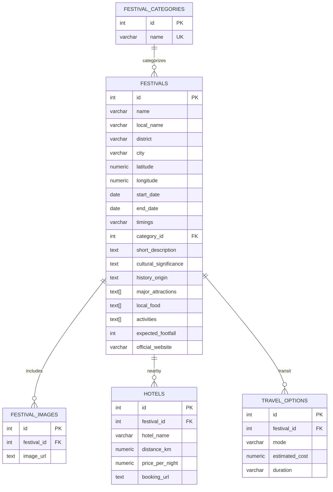

# YuktiAi - Core Festival Data & REST API Engine


Welcome to the core backend repository for **YuktiAi** — a comprehensive cultural discovery platform and cultural intelligence engine for Karnataka's festivals and heritage events.

This service manages the **PostgreSQL relational database**, automated data ingestion & seeding pipelines, and high-performance **RESTful APIs** built by **Tezraj** (*Lead Backend & Database*) and consumed by frontend web applications, mobile interfaces, AI analytics pipelines, and dashboards (**Nandish, Simran, Monika, Janvi, and Tanishi**).

---

## 📋 Features & Capabilities

- 🐘 **PostgreSQL 15 Container**: Fully relational schema with categories, master festival metadata, geospatial coordinates, media arrays, hotels, and travel options.
- ⚡ **High-Performance FastAPI**: Asynchronous REST API with automatic OpenAPI / Swagger documentation.
- 🌐 **Full CORS Support**: Preconfigured `CORSMiddleware` with `allow_origins=["*"]`, `allow_methods=["*"]`, and `allow_headers=["*"]` to ensure seamless integration across frontend dashboards.
- 🔄 **Automated Seeding Pipeline**: Idempotent data loader (`seed.py`) with support for nested image objects, hotels, travel logistics, and category normalization.
- 💾 **Data Export & Backups**: Automated snapshot scripts (`backup.py`) exporting tables directly to CSV.

---

## 🏗️ Architecture & Database Schema

The database model is defined in [`init.sql`](init.sql) and executed on PostgreSQL startup:



---

## 🚀 Step-by-Step Quickstart Guide

### 1. Prerequisites
- [Docker](https://www.docker.com/) & Docker Compose
- Python 3.10+ and `pip`

### 2. Automated One-Line Setup
```bash
chmod +x run_pipeline.sh && ./run_pipeline.sh
```

### 3. Or Run Manually:
```bash
pip install -r requirements.txt
docker compose up -d
python seed.py
uvicorn main:app --reload --port 8000
```

*Optional seeding flags:*
```bash
# Reset tables and restart identity sequence before seeding
python seed.py --reset

# Specify a custom JSON dataset file path
python seed.py --file yuktiai/festivals_karnataka.json
```

The API will be live at:
- **Base URL:** [http://localhost:8000](http://localhost:8000)
- **Interactive Swagger UI Docs:** [http://localhost:8000/docs](http://localhost:8000/docs)
- **ReDoc Documentation:** [http://localhost:8000/redoc](http://localhost:8000/redoc)

---

## 📡 REST API Documentation

All endpoints return JSON responses with standard HTTP status codes.

### 1. Health & Status Check
- **Route:** `GET /`
- **Description:** Verifies that the API service is online.
- **Example Response:**
  ```json
  {
    "status": "online",
    "message": "YuktiAi Core Database API running"
  }
  ```

---

### 2. List & Filter Festivals
- **Route:** `GET /festivals`
- **Description:** Retrieve all festivals with optional multi-parameter query filters.
- **Query Parameters:**
  | Parameter | Type | Description | Example |
  | :--- | :--- | :--- | :--- |
  | `district` | `string` | Filter by district name (case-insensitive) | `?district=Mysuru` |
  | `category` | `string` | Filter by category name (case-insensitive) | `?category=State Festival & Royal Heritage` |
  | `date` | `string` | Filter festivals active on a date (`YYYY-MM-DD`) | `?date=2026-10-15` |

- **Example Requests:**
  ```bash
  # Get all festivals
  curl "http://localhost:8000/festivals"

  # Filter by district
  curl "http://localhost:8000/festivals?district=Mysuru"

  # Combined filter: District and Date
  curl "http://localhost:8000/festivals?district=Vijayanagara&date=2026-11-07"
  ```

---

### 3. Get Festival Details by ID
- **Route:** `GET /festivals/{festival_id}`
- **Description:** Retrieve full details for a single festival, including embedded lists of media URLs, nearby hotel accommodations, and travel transit options.
- **Path Parameters:**
  | Parameter | Type | Description |
  | :--- | :--- | :--- |
  | `festival_id` | `integer` | Unique integer ID of the festival |

- **Example Request:**
  ```bash
  curl "http://localhost:8000/festivals/1"
  ```

---

## 💾 Data Backup & Export Tool

To export current database records to CSV files:
```bash
python backup.py
```
Outputs:
- `festivals_backup.csv`
- `categories_backup.csv`

---

## 👥 Integration Guide for Teammates
*(Full matrix documented in [`TEAM_ROLES.md`](TEAM_ROLES.md))*

- **Monika (Tourist Dashboard UI):** Use `http://localhost:8000/festivals` to populate map markers (using `latitude`, `longitude`), filter by district/category, and render rich media galleries.
- **Janvi (Government Analytics Dashboard):** Use `http://localhost:8000/festivals` with `expected_footfall` and `date` query params to render crowd charts, footfall statistics, and regional heatmaps.
- **Tanishi (Organizer Dashboard & Integration):** Use `http://localhost:8000/festivals/{festival_id}` to view complete festival details, manage listings, and verify end-to-end integration.
- **Nandish (AI / NLP & Recommendation):** Fetch `GET /festivals` in Python/FastAPI pipelines to extract `cultural_significance`, `major_attractions`, and `activities` for embeddings and similarity recommendations.
- **Simran (Travel Planner & Hotels):** Use `GET /festivals/{id}` to access embedded `hotels` (names, distances, price per night) and `travel_options` (transit modes, duration, costs) for automated itinerary generation.
- **CORS Notice:** Preconfigured `CORSMiddleware` allows all frontend origins (`*`). Connect directly via `fetch()` or `axios`.